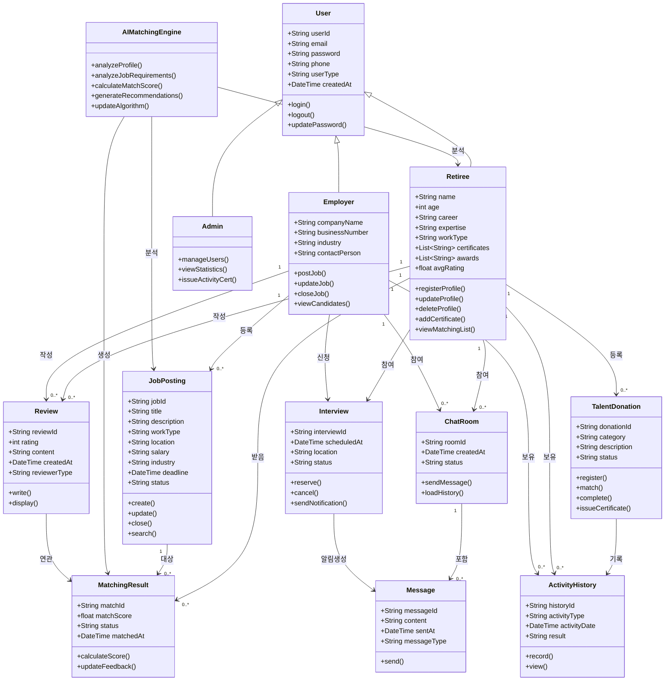
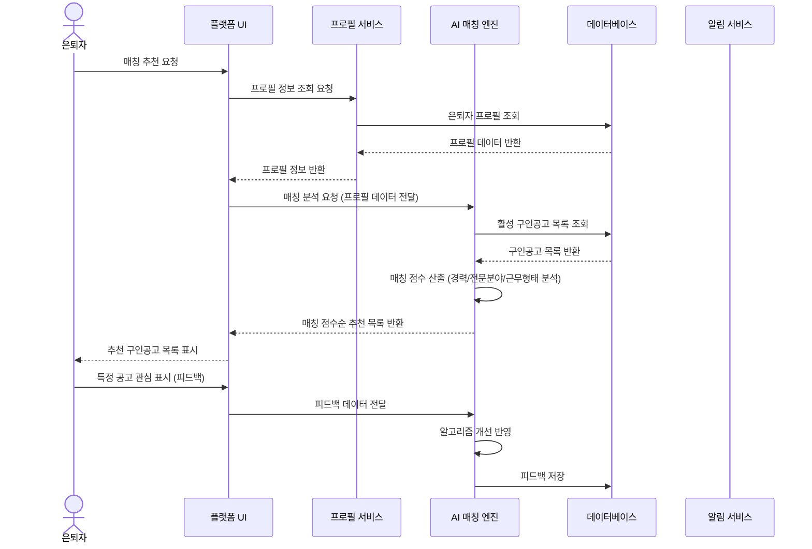
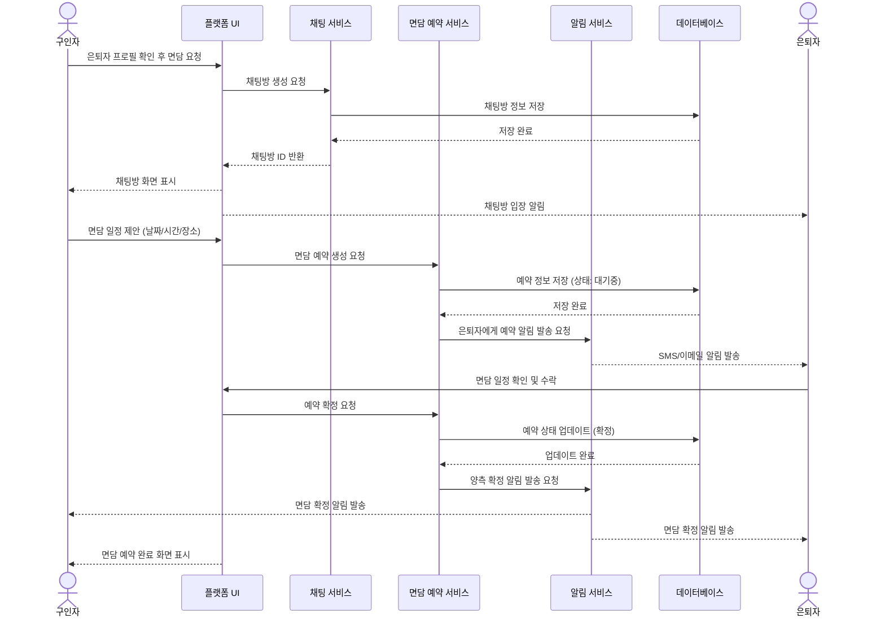
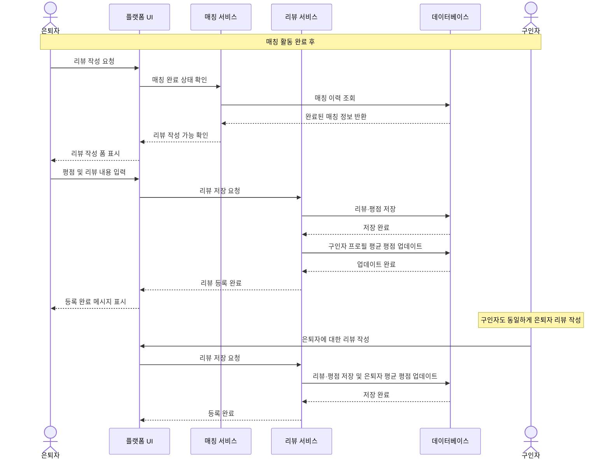
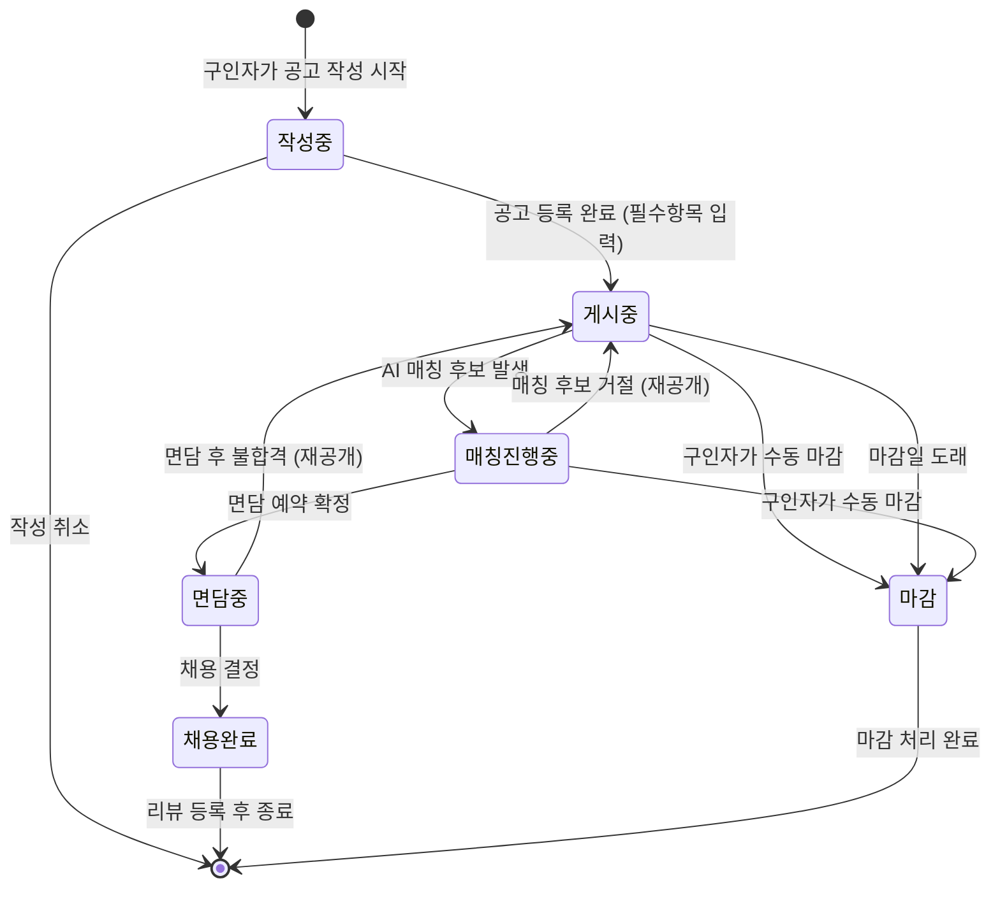
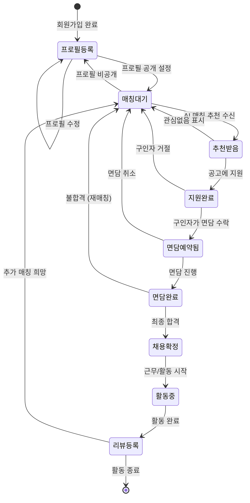

# SilverConnect 요구사항 분석서

> **프로젝트명:** 실버커넥트 (SilverConnect) - 은퇴자 재능·재취업 매칭 플랫폼  
> **버전:** 1.0  
> **작성일:** 2025년 05월

---

## 목차

1. [개요](#1-개요)
2. [기능 관점 분석 - 유스케이스 다이어그램](#2-기능-관점-분석)
3. [구조 관점 분석 - 클래스 다이어그램](#3-구조-관점-분석)
4. [행위 관점 분석 - 순차 다이어그램](#4-행위-관점-분석)
5. [상태기계 다이어그램](#5-상태기계-다이어그램)

---

## 1. 개요

SilverConnect는 은퇴자들이 보유한 전문 지식과 경험을 활용할 수 있도록 기업 및 개인과 연결해주는 AI 기반 매칭 플랫폼이다. 본 문서는 기능 관점, 구조 관점, 행위 관점에서 시스템을 분석하며, 각각 유스케이스 다이어그램, 클래스 다이어그램, 순차 다이어그램으로 표현한다.

**주요 액터:**
- **은퇴자 (Retiree):** 재취업 또는 재능기부를 희망하는 사용자
- **구인자 (Employer):** 시니어 전문인력을 필요로 하는 기업 또는 개인
- **관리자 (Admin):** 시스템 운영 및 사용자 관리 담당자
- **AI 매칭 시스템:** 자동 매칭 알고리즘 수행 주체

---

## 2. 기능 관점 분석

### 2.1 유스케이스 다이어그램

```mermaid
graph TB
    subgraph Actors["액터"]
        R([은퇴자])
        E([구인자])
        A([관리자])
        AI([AI 매칭 시스템])
    end

    subgraph System["SilverConnect 시스템"]
        subgraph ProfileMgmt["프로필 관리"]
            UC1[프로필 등록/수정/삭제]
            UC2[자격증·수상이력 추가]
            UC3[근무형태 선택]
        end

        subgraph Matching["AI 매칭"]
            UC4[구인공고 자동 추천]
            UC5[은퇴자 후보 자동 추천]
            UC6[매칭 점수 산출]
            UC7[매칭 알고리즘 개선]
        end

        subgraph JobPosting["구인공고 관리"]
            UC8[구인공고 등록]
            UC9[구인공고 검색]
            UC10[공고 수정/마감]
        end

        subgraph Communication["소통"]
            UC11[실시간 채팅]
            UC12[면담 예약]
            UC13[알림 발송]
        end

        subgraph Activity["활동 이력"]
            UC14[활동 이력 조회]
            UC15[리뷰·평점 등록]
            UC16[활동 확인서 발급]
        end

        subgraph Mentoring["재능기부·멘토링"]
            UC17[재능기부 등록]
            UC18[멘토링 매칭]
        end

        subgraph AdminFunc["관리자 기능"]
            UC19[사용자 관리]
            UC20[통계 현황 확인]
        end
    end

    R --> UC1
    R --> UC2
    R --> UC3
    R --> UC4
    R --> UC11
    R --> UC12
    R --> UC14
    R --> UC15
    R --> UC17
    R --> UC9

    E --> UC8
    E --> UC10
    E --> UC5
    E --> UC11
    E --> UC12
    E --> UC14
    E --> UC15
    E --> UC9

    AI --> UC4
    AI --> UC5
    AI --> UC6
    AI --> UC7

    A --> UC19
    A --> UC20
    A --> UC16

    UC12 --> UC13
    UC4 --> UC6
    UC5 --> UC6
    UC17 --> UC18
```

### 2.2 유스케이스 설명서

#### UC1: 프로필 등록/수정/삭제

| 항목 | 내용 |
|---|---|
| **유스케이스 ID** | UC1 |
| **유스케이스명** | 프로필 등록/수정/삭제 |
| **액터** | 은퇴자 |
| **개요** | 은퇴자가 이름, 연령, 경력, 전문분야 등 프로필 정보를 등록·수정·삭제한다 |
| **사전 조건** | 은퇴자가 시스템에 로그인한 상태 |
| **사후 조건** | 프로필 정보가 시스템에 저장되어 AI 매칭에 활용됨 |
| **기본 흐름** | 1. 프로필 메뉴 접근 → 2. 정보 입력(이름/연령/경력/전문분야) → 3. 근무형태 선택 → 4. 저장 |
| **예외 흐름** | 필수 항목 미입력 시 오류 메시지 표시 후 재입력 요청 |
| **관련 요구사항** | FR-001, FR-003, FR-004 |

#### UC4: 구인공고 자동 추천 (AI 매칭)

| 항목 | 내용 |
|---|---|
| **유스케이스 ID** | UC4 |
| **유스케이스명** | 구인공고 자동 추천 |
| **액터** | 은퇴자, AI 매칭 시스템 |
| **개요** | AI가 은퇴자의 경력·전문분야를 분석하여 최적의 구인공고를 자동 추천한다 |
| **사전 조건** | 은퇴자 프로필이 등록된 상태, 매칭 가능한 구인공고 존재 |
| **사후 조건** | 매칭 점수 순으로 정렬된 추천 목록 제공 |
| **기본 흐름** | 1. 프로필 분석 요청 → 2. AI가 경력/전문분야 분석 → 3. 매칭 점수 산출 → 4. 상위 공고 목록 반환 |
| **예외 흐름** | 매칭 공고 없을 시 "현재 적합한 공고가 없습니다" 안내 |
| **관련 요구사항** | FR-005, FR-007, FR-008 |

#### UC12: 면담 예약

| 항목 | 내용 |
|---|---|
| **유스케이스 ID** | UC12 |
| **유스케이스명** | 면담 예약 |
| **액터** | 은퇴자, 구인자 |
| **개요** | 구인자와 은퇴자가 면담 일정을 조율하고 예약한다 |
| **사전 조건** | 양측이 매칭된 상태로 채팅이 가능한 상태 |
| **사후 조건** | 면담 일정이 등록되고 양측에 알림 발송 |
| **기본 흐름** | 1. 면담 예약 요청 → 2. 가능 일정 제시 → 3. 상대방 확인 → 4. 예약 확정 → 5. 알림 발송 |
| **예외 흐름** | 일정 충돌 시 다른 일정 제안 |
| **관련 요구사항** | FR-013, FR-014 |

---

## 3. 구조 관점 분석

### 3.1 클래스 다이어그램

---

## 4. 행위 관점 분석

### 4.1 순차 다이어그램 1: AI 매칭 추천 프로세스

### 4.2 순차 다이어그램 2: 면담 예약 프로세스

### 4.3 순차 다이어그램 3: 리뷰 및 평점 등록 프로세스

---

## 5. 상태기계 다이어그램

### 5.1 구인공고 상태 다이어그램

### 5.2 은퇴자 매칭 상태 다이어그램

---

## 부록: 요구사항 추적 매트릭스

| 유스케이스 | 관련 기능 요구사항 | 관련 비기능 요구사항 |
|---|---|---|
| UC1 프로필 관리 | FR-001, FR-002, FR-003, FR-004 | NFR-003, NFR-004 |
| UC4 AI 매칭 추천 | FR-005, FR-007, FR-008 | NFR-001, NFR-006 |
| UC5 은퇴자 추천 | FR-006, FR-007, FR-008 | NFR-001, NFR-006 |
| UC8 구인공고 등록 | FR-009 | NFR-001, NFR-004 |
| UC9 공고 검색 | FR-010 | NFR-001, NFR-003 |
| UC11 실시간 채팅 | FR-012 | NFR-001, NFR-002 |
| UC12 면담 예약 | FR-013, FR-014 | NFR-001 |
| UC14 활동 이력 | FR-015 | NFR-004 |
| UC15 리뷰·평점 | FR-016, FR-017 | NFR-004 |
| UC17 재능기부 | FR-018, FR-019, FR-020 | NFR-003 |
| UC19 사용자 관리 | IR-004 | NFR-004 |
